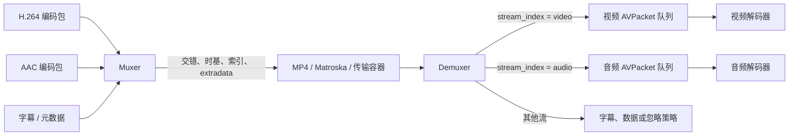

# 复用与解复用

> [!tip] 阅读提示
> **前置：** [[FFmpeg 与媒体处理地图]]。
> **初读：** 先读「一句话说明」和「核心机制」，弄清 复用与解复用 解决什么问题、不负责什么。
> **深入：** 「工程要点」、「关键参数与取舍」、「常见误区与故障」 在实现、联调或排障时再读。

## 一句话说明

复用（mux）把多个已编码流及其时间、元数据组织为一个容器输出；解复用（demux）从容器或输入协议中解析出独立的流和压缩包。它只负责媒体组织和边界识别，不负责把压缩包解码成像素或 PCM。

## 核心机制

- FFmpeg 解复用流程通常是打开输入、读取流信息、选择目标 `AVStream`，再反复调用 `av_read_frame()` 得到带 `stream_index`、PTS/DTS 和引用数据的 [[AVPacket 与 AVFrame|AVPacket]]。
- 复用器按容器规则接收各流的编码包，可能重新交错、写入 extradata、索引和尾部元数据。输出包的时间必须使用对应流的 time base。
- 音视频包到达顺序、文件存储顺序和显示顺序是三个不同概念；B 帧会让解码顺序与显示顺序分离。
- 读取结束、输入阻塞、格式错误、网络断开和时间戳异常都必须区分。对实时源不能把“暂时无包”一律当作 EOF。

Muxer 组织的是已经编码的数据，Demuxer 拆出的也仍是压缩包；只有后面的解码器才把它们变成像素或 PCM。图中多条流在容器里可以交错存放，但它们各自的 PTS/DTS 和 time base 仍要独立解释。

## 工程要点

- 解复用器输出包后要尽快转移到有界的音频/视频包队列；队列满时应有背压、丢弃或降级策略，不能无限增长。
- 通过 `AVStream->codecpar` 配置解码器上下文时，注意 extradata 的所有权和生命周期；容器解析成功不代表解码器一定支持该 profile。
- 复用时不要把 RTP 序号直接当容器 PTS，也不要把容器包大小当网络 MTU；每层都应按自己的时钟和包化规则处理。
- 转封装验证至少覆盖单流、多流、可变帧率、B 帧、缺失时间戳、非零起始时间和截断文件。

## 问题边界

- 解复用器只把输入字节解释为流和压缩包；它不会替调用方完成解码、重排、FEC、RTP 丢包恢复或播放。
- `av_read_frame()` 对文件通常在 EOF 返回负值；网络、自定义 IO 和实时设备可能阻塞、暂时无数据或返回 IO 错误，应用必须区分这些状态。
- 复用器接受的是编码域包和时间信息，不能把 PCM 样本或已显示画面直接当作任意容器包写入。

## 数据结构与格式

解复用上下文通常包含输入格式、IO、流列表、全局 metadata 和 seek 信息；`AVStream` 保存 codec parameters、time base、duration 和 disposition；每个 `AVPacket` 保存 `stream_index`、数据引用、PTS/DTS、duration 和 side data。复用端还要维护输出 `AVFormatContext`、流映射和 interleave 状态。

| 阶段 | 关键 API/对象 | 结果 |
| --- | --- | --- |
| 探测/打开 | `avformat_open_input` | 建立 IO 与格式探测 |
| 读取流信息 | `avformat_find_stream_info` | 填充流与 codec parameters |
| 读包 | `av_read_frame` | 得到一个压缩域 packet |
| 写头/包 | `avformat_write_header`、`av_interleaved_write_frame` | 写入容器并按规则交错 |
| 收尾 | `av_write_trailer` | 写索引/尾部元数据（若格式支持） |

## 解复用步骤

1. 打开输入并验证协议、格式探测和 IO 超时配置。
2. 找到音频/视频流，复制或转换 codec parameters，检查 extradata。
3. 循环读取 packet，按 `stream_index` 转移引用到各自有界队列。
4. 队列满时实施背压、丢弃过期数据或终止，而不是继续无限读入。
5. EOF、超时、断流和取消时关闭读取线程，唤醒队列消费者并释放上下文。

## 时间与缓冲关系

音视频包可能交错到达，但各流的 time base 不同；解复用层只负责保留/转换时间，不决定呈现。读取线程过快会使包队列吞吐高于解码/播放，读取线程过慢则可能造成设备欠载。队列应同时记录包数、字节数、最早/最晚 PTS 和墙上等待时间。

## 关键参数与取舍

- probe/analyze duration：影响格式探测完整度与首帧延迟。
- IO timeout/reconnect：影响网络故障恢复与关闭时间，不能无限阻塞退出。
- stream mapping：只选择需要的流可减少 CPU/内存，但要保留字幕/数据流时明确业务需求。
- interleave delta/max delay：影响多流写入公平性和实时输出的等待。

## 常见误区与故障

- 把 `av_read_frame` 读到的包直接交给所有解码器：必须按 `stream_index` 路由。
- 复用时不做 `av_packet_rescale_ts`：不同 time base 会使输出时长、PTS 或 seek 位置错误。
- 以 `packet->size == 0` 判断 EOF：EOF 是 API 返回值，零大小包可能有特殊语义。
- 输入流信息不足就立即创建解码器：动态/网络容器可能需要更多探测，应用要设置上限并处理不完整参数。

## 可观测与验证

- 记录探测耗时、流参数、每流 packet 数/bytes、PTS/DTS 单调性、队列深度、read 调用耗时和 IO 错误。
- 用音视频交错、B 帧、可变帧率、非零起点、无索引和慢速/断开输入测试读取与关闭。
- remux 前后用 `ffprobe` 比较 stream codec parameters、time base、首尾包和关键帧；对异常点保留最小样本文件。

## 具体例子

解复用到一个包含 H.264、AAC 和字幕的 MP4 时，读取线程收到字幕包不能丢给视频解码器；应按 `stream_index` 放入对应队列或按业务忽略。若只做音视频播放，过滤字幕可以省队列和解析开销，但复用回写时必须明确是否保留原字幕流。

## 阅读导航

- **上一篇：** [[码流与容器]]
- **下一篇：** [[AVPacket 与 AVFrame]]
- **所属专题：** [[00-知识地图/专题说明/13 RTC 媒体处理与 FFmpeg|13 RTC 媒体处理与 FFmpeg]]
- **回看：** [[RTC 知识总览]] · [[00-知识地图/学习路线/学习进度模板|学习进度]] · [[00-知识地图/学习路线/RTC 工程师学习路线.canvas|阶段路线]]

> 读完先回所属专题做练习/验收，再点下一篇。内部链接最多再追一层；不影响理解的陌生词先记下。

## 图谱关系

- 主题：[[FFmpeg 与媒体处理地图]]
- 组织：[[码流与容器]]
- 输出对象：[[AVPacket 与 AVFrame]]
- 时间：[[PTS DTS 与时间基]]
- 解码：[[FFmpeg 解码状态机]]

## 参考资料

- 《FFmpeg API 与解码流程参考》，解码流程、AVStream 和 AVFormatContext，`90-参考资料\音视频与 WebRTC 书库\ffmpeg-api-decoding-reference-zh\content\01-decoding-flow-and-concepts.md`、`90-参考资料\音视频与 WebRTC 书库\ffmpeg-api-decoding-reference-zh\content\03-avstream.md`、`90-参考资料\音视频与 WebRTC 书库\ffmpeg-api-decoding-reference-zh\content\04-avformatcontext.md`。
- 《FFmpeg ffplay 源码分析》，libavformat 与播放器读取流程，`90-参考资料\音视频与 WebRTC 书库\ffmpeg-ffplay-source-analysis-zh\content\04-libavformat.md`、`90-参考资料\音视频与 WebRTC 书库\ffmpeg-ffplay-source-analysis-zh\content\06-ffplay.md`。
- 《FFmpeg Basics》，第 2、11、12 章，`90-参考资料\音视频与 WebRTC 书库\ffmpeg-basics\translation\02-ffmpeg-fundamentals.md`、`90-参考资料\音视频与 WebRTC 书库\ffmpeg-basics\translation\12-format-conversion.md`。
