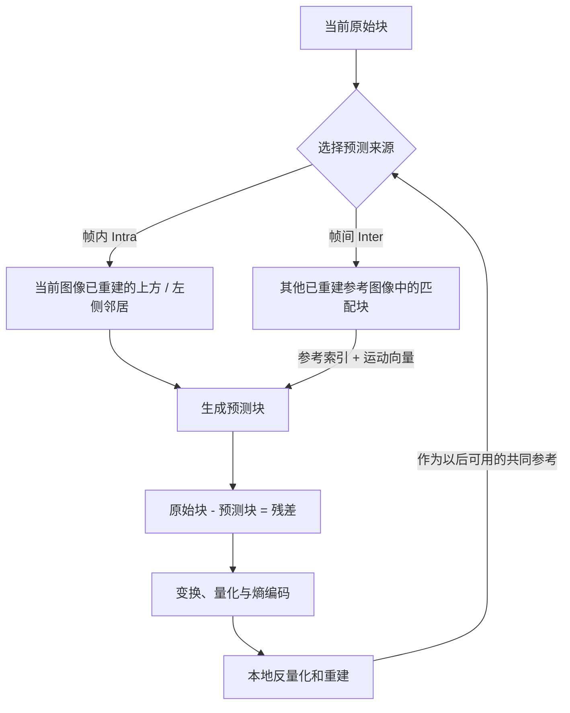

# 帧内与帧间预测

> [!tip] 阅读提示
> **前置：** [[视频编解码]] 初读即可。
> **初读：** 读到「初读到此为止」就停。弄清：帧内预测 vs 帧间预测各省什么冗余，以及残差为何还要变换量化。
> **深入：** 模式选择、运动估计边界、与率失真关系，对照 [[变换量化与熵编码]] 时再读。

## 一句话说明

预测编码不直接编码整块像素，而是先用可由解码端重建的参考样本生成预测值，再编码原图与预测值之间的残差。帧内预测只使用当前图像中已重建的邻居；帧间预测使用其他图像中的参考块和运动信息。

## 先记住这三句

1. **帧内预测**：用同一帧里已重建的邻居块猜当前块——关键帧主要靠它。
2. **帧间预测**：用前后参考帧做运动补偿猜当前块——多数帧的压缩主力。
3. 预测对了就少传；传的是 **残差**（再变换、量化、熵编码）。预测参考坏了，残差再对也可能解花。

## 核心机制

- 帧内模式沿水平、垂直或角度方向外推边界样本，也可能使用 DC/平面模式。编码器通过率失真代价选择模式，解码器用同样的重建邻居复现预测。
- 帧间模式发送参考图像索引、运动向量和残差。运动补偿通常支持整数、半像素或更细的插值，预测块可来自前向、后向或双向参考。
- 预测环路使用“解码端将看到的重建样本”，而不是原始输入；量化造成的误差因此会进入后续参考帧并可能传播。
- 帧划分、块大小、参考列表和运动搜索范围共同决定压缩效率与计算量；较大的搜索和更多参考通常增加 CPU、内存与延迟。

**图在说什么：** 当前块可从本帧邻居（帧内）或其它参考帧（帧间）生成预测，再只编码残差。

编码器虽然能查看原始图像寻找最佳模式，但真正进入预测环路的是量化后重建出的样本，因为解码器只能得到这份重建结果。两端以同样参考继续预测，状态才不会逐帧漂移。

## 具体例子

摄像头画面整体向右移动时，一个运动向量加少量残差通常比逐像素帧内编码省比特；若场景突然从会议室切到白板，旧参考的匹配代价会变高，编码器可能选择更多帧内块或触发关键帧。实验时应同时记录码率峰值和编码耗时，而不是只看单帧 PSNR。

---

> [!warning] 初读到此为止
> 上面这些已经够第一次阅读。下面是工程展开与排障细节（字段、参数、误区与观测），**第二轮或遇到具体问题时再读**；第一次直接点文末「第一次阅读下一站」即可。

## 工程要点

- 运动估计是编码器最耗时的部分之一。RTC 可减少搜索范围、限制参考帧、降低前瞻，换取可预测的延迟和 CPU。
- 参考帧丢包会使当前帧及其后继帧无法正确预测；恢复策略必须结合 [[GOP 与参考帧]]和播放截止时间，而不是只看单包丢失。
- 摄像机快速运动、场景切换和遮挡会降低帧间预测收益，可能触发更高码率或关键图像；码率控制要预留峰值空间。
- 像素格式、位深和色度采样直接影响预测样本。编码前的格式转换应固定矩阵、范围和对齐方式。

## 问题边界

- 预测只描述如何生成候选图像和残差，不负责熵编码、网络分片或播放调度；预测成功也不保证码流在网络上完整到达。
- “参考帧”是编码器/解码器重建环路中的图像，不等同于摄像头原始帧或显示器已经显示的帧。
- 编码器可以尝试很多候选模式，解码器只执行码流选定的模式；因此编码复杂度远高于解码复杂度是常见取舍。

## 数据结构与格式

一个预测块通常携带块划分、帧内模式或参考列表索引、运动向量、残差和必要的旁信息。运动向量以像素或分数像素精度表达位移；参考列表描述从哪些已重建图像读取块。边界块可能需要填充/外推，色度分量的块尺寸和向量尺度还受色度抽样影响。

| 类型 | 参考来源 | 典型代价 |
| --- | --- | --- |
| 帧内 DC/平面/角度 | 当前图像已重建邻居 | 无时间依赖，残差/码率可能更高 |
| 前向帧间 | 过去参考图像 | 低延迟，无法利用未来运动 |
| 后向/双向 | 过去和未来参考图像 | 压缩更好，但需要重排序和缓冲 |
| Skip/merge | 继承邻近运动/残差状态 | 码率低，但依赖上下文正确 |

## 编码步骤

1. 将当前图像划分为候选块，检查可用邻居和参考列表。
2. 生成帧内预测或搜索参考图像中的运动匹配块。
3. 对候选预测计算残差，估计编码比特数和失真。
4. 用率失真代价选择块大小、预测模式、运动向量、参考帧和量化参数。
5. 对残差编码并重建预测+残差，放入参考图像缓冲；解码端按相同语法复现。

## 时间与缓冲关系

帧间预测引入参考帧保留时间和解码依赖；B 帧还会增加编码/解码重排序。参考缓冲区过小会降低压缩效率，过大则增加内存和切换复杂度。RTC 低延迟配置通常让参考图像尽快可解码，并限制前瞻、B 帧和运动搜索，以保证编码结果赶得上播放截止时间。

## 关键参数与取舍

- 搜索范围和亚像素精度：提高匹配质量但增加编码 CPU。
- 参考帧数量和链深度：提升压缩率但扩大依赖、内存和丢包影响。
- 块划分深度：小块适合细节/运动，大块适合平坦区域；过度搜索会放大延迟。
- 帧内刷新/关键帧策略：缩短错误恢复时间，但产生码率峰值并中断长期预测。

## 常见误区与故障

- 用原始输入像素生成参考：编码器必须用量化后的重建像素，否则编码器和解码器状态会漂移。
- 认为 P 帧一定只依赖上一帧：实际可能使用多个列表和更早参考，具体由码流语法决定。
- 参考包丢失只影响一帧：后续依赖帧可能持续损坏，直到新参考或关键帧建立。
- 只优化运动搜索而不看发送排队：编码质量提升可能导致码率峰值和实时延迟恶化。

## 可观测与验证

- 记录帧内/帧间比例、每帧参考列表、运动向量范围、块大小分布、编码耗时、QP、残差码率和参考帧占用。
- 用静止、平移、快速镜头、场景切换、细文字和遮挡序列对比参考数量/搜索范围，观察质量与 P95 编码时间。
- 在指定参考包丢失后，测量错误持续帧数、PLI/FIR 到可解码帧的时间、关键帧大小和恢复期间队列变化。

## 阅读导航

- **上一篇：** [[视频编解码]]
- **下一篇：** [[变换量化与熵编码]]
- **所属专题：** [[00-知识地图/专题说明/08 视频编码与 H.264|08 视频编码与 H.264]]
- **回看：** [[RTC 知识总览]] · [[00-知识地图/学习路线/学习进度模板|学习进度]] · [[00-知识地图/学习路线/RTC 工程师学习路线.canvas|阶段路线]]

- **第一次阅读下一站：** [[变换量化与熵编码]]

> 读完先回所属专题做练习/验收，再点下一篇。内部链接最多再追一层；不影响理解的陌生词先记下。

## 图谱关系

- 主题：[[视频编码地图]]
- 像素：[[YCbCr 与色度抽样]]
- 残差：[[变换量化与熵编码]]
- 结构：[[GOP 与参考帧]]
- 实现：[[H264]]

## 参考资料

- 《Coding Video: A Practical Guide to HEVC and Beyond》，第 5、6 章，`90-参考资料\音视频与 WebRTC 书库\coding-video\translation\05-intra-prediction.md`、`90-参考资料\音视频与 WebRTC 书库\coding-video\translation\06-inter-prediction.md`。
- 《Video Demystified Handbook》，预测与运动补偿章节，`90-参考资料\音视频与 WebRTC 书库\video-demystified-handbook-zh\content`。
- 《WebRTC 权威指南》，视频编码和关键帧章节，`90-参考资料\音视频与 WebRTC 书库\webrtc-authoritative-guide-zh\content`。
