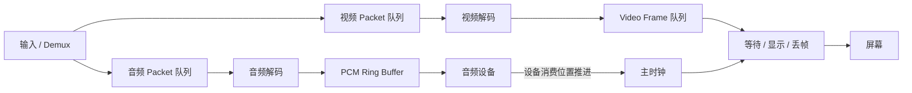

# 播放器队列与主时钟

> [!tip] 阅读提示
> **前置：** [[抖动缓冲]]。
> **初读：** 先读「一句话说明」和「核心机制」，弄清 播放器队列与主时钟 解决什么问题、不负责什么。
> **深入：** 「工程要点」、「关键参数与取舍」、「常见误区与故障」 在实现、联调或排障时再读。

## 一句话说明

播放器把解复用、解码、滤镜和设备输出拆成有界队列与异步阶段。主时钟是安排媒体呈现的参考时间，可以选择音频时钟、视频时钟或外部单调时钟；音视频同步的关键不是让两个队列同时增长，而是让各帧的媒体时间相对于同一参考按时呈现。

## 核心机制

- 典型管线是：读取线程产生 [[AVPacket 与 AVFrame|AVPacket]] → 音视频包队列 → 解码线程产生帧 → 音频播放缓冲/视频帧队列 → 设备呈现。每个队列都有容量、阻塞、丢弃和关闭语义。
- 音频设备通常以持续消耗的采样时钟作为稳定参考；视频刷新线程比较下一帧 PTS 与主时钟，决定等待、立即显示、丢帧或重复。直播场景也可选外部接收时钟，但要明确延迟目标。
- [[PTS DTS 与时间基]]负责把帧时间转换到可比较的域；主时钟负责调度，不应直接修改源时间戳来掩盖设备或网络问题。
- 解码缓冲解决计算抖动，播放队列解决设备消费抖动，实时传输的 [[抖动缓冲]]解决网络到达抖动；三者的等待预算不能重复计算。

当音频作为主时钟时，视频帧不是“队列一有就显示”：其 PTS 领先主时钟就等待，明显落后且可安全丢弃就跳过。每个队列都必须有容量和关闭语义，否则下游变慢会被伪装成不断增长的播放延迟。

## 工程要点

- 队列至少限制包数、字节数和媒体时长，关闭时唤醒所有等待线程并拒绝新任务。无界队列会把网络或解码异常转化为不断增长的端到端延迟。
- 视频落后主时钟时应优先丢弃仍未显示且可安全丢弃的帧；视频领先时短暂等待。音频通常不应频繁丢样本，必要时使用小幅重采样或时域调整平滑漂移。
- 监控队列深度、最老/最新 PTS、解码耗时、设备欠载、丢帧数和 A/V diff；不要只记录线程是否“运行正常”。
- 线程之间传递 frame 要有明确所有权，事件循环、音频回调和解码线程退出顺序要固定，防止回调访问已释放的播放器状态。

## 问题边界

- 播放器队列解决阶段之间的速率不匹配，主时钟解决“何时呈现”；它们不能替代网络重传、编解码错误恢复或设备时钟校准。
- 文件播放器可以等待未来数据，RTC 播放器通常有明确播放截止时间；同一套“永不丢帧”的策略不适合实时通话。
- 音频设备时钟、视频渲染时钟、外部单调时钟和媒体 PTS 都是不同来源，选择主时钟前要明确同步目标和漂移处理。

## 数据结构与队列

典型播放器状态包含：输入格式/流、音视频 packet queue、解码器、音频 PCM ring buffer、视频 frame queue、主时钟、播放状态、seek/flush 标志和退出条件。每个队列应保存元素的 PTS、duration、字节数、插入/取出单调时间以及引用所有权。

| 队列 | 输入 | 输出 | 满/空策略 |
| --- | --- | --- | --- |
| packet queue | demux packet | decoder send | 背压或丢弃过期包 |
| decoded frame queue | decoder frame | filter/render | 丢过期视频，音频谨慎处理 |
| audio device buffer | PCM frame | 声卡消费 | 欠载补静音/降级 |
| video schedule queue | 可显示 frame | vsync/渲染 | 等待、丢帧或重复 |

## 调度步骤

1. 读取线程按流将 packet 放入有界队列，队列满时暂停读取或执行明确丢弃策略。
2. 解码线程送入 codec，循环 receive；frame 先保存引用，再按 PTS 放入帧队列。
3. 音频输出以设备消费位置推进 audio clock；视频线程取最早 frame 计算与主时钟的差值。
4. 视频领先时等待到目标时间，落后超过阈值时丢弃可安全丢弃帧；轻微漂移用音频重采样/时间伸缩平滑。
5. seek、暂停、停止和关闭时按固定顺序停止输入、唤醒队列、flush codec、清理 frame，再关闭设备。

## 时间与缓冲关系

总延迟可拆为输入采集/读盘、packet queue、解码、filter、frame queue、音频设备 buffer 和显示等待。队列深度应同时以毫秒和元素数显示；只看元素数无法比较不同帧率/码率。主时钟应使用单调递增的可测量时间，媒体 PTS 通过 time base 映射到同一坐标。

## 关键参数与取舍

- packet/frame queue 的最大时长：越大越抗瞬时抖动，但延迟和内存越高。
- 视频丢帧阈值、重复帧上限和音频漂移阈值：决定流畅性与同步误差。
- 音频 callback buffer/period：小 buffer 低延迟但更容易欠载，大 buffer 稳定但增加延迟。
- 主时钟选择：音频适合连续播放，视频适合外部显示驱动，外部时钟适合统一控制，但都要处理漂移。

## 常见误区与故障

- 队列越大越稳定：无界或过大队列会把短暂拥塞变成长时间延迟。
- 看到视频落后就加速渲染：可能造成跳帧、撕裂或 CPU 峰值，应先检查主时钟和 PTS。
- 音频和视频各自按线程当前时间播放：两个线程的调度时间不是媒体同步基准。
- 关闭时只设置 `quit`：阻塞在条件变量、设备 callback 或读 IO 的线程可能永远不退出。

## 可观测与验证

- 每 100 ms 记录 packet/frame queue 时长、最老/最新 PTS、audio clock、video PTS、A/V diff、decode/filter/render P95/P99、丢帧和欠载。
- 用恒定帧率、VFR、B 帧、音频采样时钟漂移、慢盘、突发网络延迟、seek 和设备拔出测试调度。
- 画出主时钟与音视频 PTS 的曲线，区分“数据没到”“解码慢”“队列过深”“设备欠载”和“时钟漂移”。

## 具体例子

若视频下一帧 PTS 比音频主时钟领先 35 ms，播放器可以短暂等待；若视频落后 200 ms 且后续帧仍可解码，逐帧赶播通常会造成 CPU 峰值，应根据策略丢弃过期视频帧，保留音频连续性并记录丢帧原因。

## 阅读导航

- **上一篇：** [[音视频同步]]
- **下一篇：** [[00-知识地图/专题说明/07 音频处理与 Opus|07 音频处理与 Opus]]（本专题配套详解已读完，进入下一专题说明）
- **所属专题：** [[00-知识地图/专题说明/06 时间系统与音画同步|06 时间系统与音画同步]]
- **回看：** [[RTC 知识总览]] · [[00-知识地图/学习路线/学习进度模板|学习进度]] · [[00-知识地图/学习路线/RTC 工程师学习路线.canvas|阶段路线]]

> 读完先回所属专题做练习/验收，再点下一篇。内部链接最多再追一层；不影响理解的陌生词先记下。

## 图谱关系

- 数据：[[AVPacket 与 AVFrame]]
- 时间：[[PTS DTS 与时间基]]
- 网络输入：[[抖动缓冲]]
- 时钟：[[时钟与时间戳]]
- 变换：[[FilterGraph 重采样与缩放]]

## 参考资料

- 《FFmpeg 播放器教程》，队列、线程与同步章节，`90-参考资料\音视频与 WebRTC 书库\ffmpeg-player-tutorial-zh\content\04-tutorial-4.md`、`90-参考资料\音视频与 WebRTC 书库\ffmpeg-player-tutorial-zh\content\05-tutorial-5.md`。
- 《FFmpeg ffplay 源码分析》，ffplay 队列和时钟章节，`90-参考资料\音视频与 WebRTC 书库\ffmpeg-ffplay-source-analysis-zh\content\06-ffplay.md`。
- 《FFmpeg Basics》，第 12、16、26 章，`90-参考资料\音视频与 WebRTC 书库\ffmpeg-basics\translation\13-time-operations.md`、`90-参考资料\音视频与 WebRTC 书库\ffmpeg-basics\translation\17-digital-audio.md`、`90-参考资料\音视频与 WebRTC 书库\ffmpeg-basics\translation\26-debugging-and-tests.md`。
