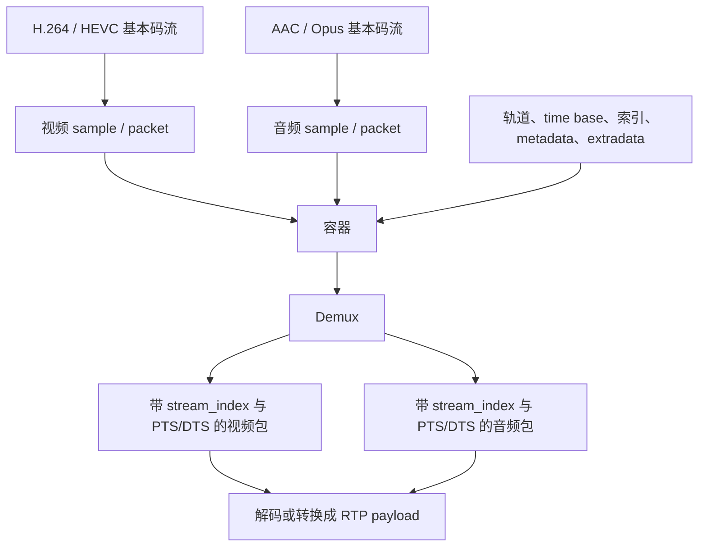

# 码流与容器

> [!tip] 阅读提示
> **前置：** [[FFmpeg 与媒体处理地图]]。
> **初读：** 先读「一句话说明」和「核心机制」，弄清 码流与容器 解决什么问题、不负责什么。
> **深入：** 「工程要点」、「关键参数与取舍」、「常见误区与故障」 在实现、联调或排障时再读。

## 一句话说明

编码器输出的压缩数据称为基本码流（elementary stream），例如 H.264 NAL 单元或 AAC 访问单元。容器把一个或多个音视频/字幕基本码流组织成带轨道、元数据、索引和时间信息的媒体文件或传输格式。编码格式回答“数据如何压缩”，容器回答“如何组织和定位这些数据”。

## 核心机制

- 基本码流通常按帧、访问单元或 NAL 单元解析；容器把它们包装成样本/包，并提供流参数、时基、持续时间和偏移信息。
- Annex B H.264 以起始码分隔 NAL，MP4 常使用长度前缀；同一编码内容从文件取出送进 RTP 或解码器前，可能需要转换封装而不改变图像本身。
- 容器中的音频和视频可以交错存储，解复用器依据索引或扫描结果输出带 `stream_index` 的包。容器包边界不一定等于编码帧边界，也不保证一个包对应一个 RTP 包。
- MP4 等格式需要在文件尾或独立索引中保存信息，网络直播/实时会话则更关注可渐进解析、低首帧延迟和断流恢复。

基本码流回答“压缩语法是什么”，容器回答“有哪几条轨道、每个样本在哪里、何时播放”。容器 sample、编码帧和 RTP 包可能恰好一一对应，也可能被聚合或拆分，不能依赖这种偶然关系写解析器。

## 工程要点

- 用 `ffprobe` 或等价工具同时检查容器格式、流参数、编码 profile、时间戳、帧率、像素格式和音频布局；只看文件扩展名不可靠。
- 封装转换时保留或重新计算 codec extradata、PTS/DTS、时基和关键帧索引；错误的时间基会表现为快慢播放、音画漂移或无法 seek。
- H.264/AAC 的码流与容器要分层测试：先验证编码器输出可解码，再验证 mux/demux，再验证网络打包，避免把不同层的问题混在一起。
- 容器的元数据和索引不是实时网络的可靠状态。实时接入应对截断、缺索引、时间戳跳变、流切换和不完整尾包有明确策略。

## 问题边界

- 基本码流只描述压缩语法，容器还要描述轨道、索引、时间和元数据；两者都不等于解码器内部的像素/样本帧。
- 文件容器往往可以 seek、索引和交错，实时输入可能没有文件尾、完整索引或稳定的字节位置。相同编码内容在这两种场景下的读取策略不同。
- 封装转换通常不重新编码，但如果需要改变 GOP、分辨率、采样率或码率，就已经进入转码，延迟、质量和资源边界都会改变。

## 数据结构与格式

| 层 | 示例 | 需要核对的字段 |
| --- | --- | --- |
| 基本码流 | H.264 NAL、AAC access unit | 语法、参数集、访问单元边界 |
| 容器 sample | MP4 sample、Matroska block | size、offset、DTS/CTS、关键帧 |
| FFmpeg packet | `AVPacket` | stream index、PTS/DTS、duration、side data |
| 网络 payload | RTP payload | sequence、timestamp、MTU、负载格式 |

Annex B 的 H.264 起始码、AVC length-prefixed NAL、ADTS AAC 和 MP4 extradata 不能互相直接替换。转换器必须知道输入输出期望的边界和配置，不能仅通过删除几个字节“猜”出正确封装。

## 解析与封装步骤

1. 探测输入格式并读取全局/流级参数，确认是否需要自定义 IO。
2. 建立 `AVStream` 和 codec parameters，选择目标音视频流。
3. 解复用为带时间戳的压缩包，按流送入解码器或直接转封装。
4. 复用时把目标流的包按容器 time base 写入，维护交错、索引和 extradata。
5. 结束时 flush/写 trailer；实时或异常关闭时明确哪些元数据可能无法写出。

## 时间与缓冲关系

容器索引让播放器可以跳到目标时间，但索引位置和媒体 PTS 不是同一个坐标。交错写入会让音频包和视频包在文件中交替出现；解复用器读取顺序也可能受 IO 缓冲、网络阻塞和索引策略影响。实时播放应使用媒体时间和主时钟调度，不要把文件字节偏移当播放时间。

## 关键参数与取舍

- faststart/索引位置：改善文件首播但可能需要重新组织尾部元数据。
- interleave：改善多流读取连续性，但可能增加等待或尾部延迟。
- extradata：解码器初始化所需，缺失/错误会导致“容器能探测、解码失败”。
- 时间戳策略：保留原始时间、重基准或生成缺失时间戳，各自影响 seek、同步和直播切换。

## 常见误区与故障

- 把文件扩展名当容器事实：扩展名可以错误或被重命名，必须探测实际字节结构。
- 把容器 sample 当编码帧或 RTP 包：容器可能合并/拆分数据，网络层还会有 MTU 分片。
- 只转移编码包却忘记 extradata：首帧、参数集或硬件解码可能失败。
- 看到 `duration` 就当作实时可用时长：直播输入可能未知、变化或受时钟/断流影响。

## 可观测与验证

- 保存格式名、流数量、codec id/profile、extradata 长度、time base、首尾 PTS/DTS、关键帧索引和每流包大小分布。
- 对同一源做 remux 与 transcode 两条路径，分别用 `ffprobe -show_streams -show_packets` 比较参数、时间戳、帧数和可 seek 性。
- 通过截断文件、损坏索引、缺失尾部、时间戳跳变、流顺序变化和实时断流测试错误处理。

## 具体例子

把 Annex B H.264 放入 MP4 通常需要把起始码分隔的 NAL 转为长度前缀，并把 SPS/PPS 放入容器的 codec configuration；这一步不改变图像预测内容。再把 MP4 sample 送往 RTP 时，可能还要反向生成符合 RTP payload 的 NAL 边界和分片，不能直接发送整个文件 sample。

## 阅读导航

- **上一篇：** [[00-知识地图/专题说明/13 RTC 媒体处理与 FFmpeg|13 RTC 媒体处理与 FFmpeg]]（回到本专题说明）
- **下一篇：** [[复用与解复用]]
- **所属专题：** [[00-知识地图/专题说明/13 RTC 媒体处理与 FFmpeg|13 RTC 媒体处理与 FFmpeg]]
- **回看：** [[RTC 知识总览]] · [[00-知识地图/学习路线/学习进度模板|学习进度]] · [[00-知识地图/学习路线/RTC 工程师学习路线.canvas|阶段路线]]

> 读完先回所属专题做练习/验收，再点下一篇。内部链接最多再追一层；不影响理解的陌生词先记下。

## 图谱关系

- 主题：[[FFmpeg 与媒体处理地图]]
- 音视频格式：[[H264]]、[[AAC]]
- 解封装：[[复用与解复用]]
- 时间：[[PTS DTS 与时间基]]

## 参考资料

- 《Coding Video: A Practical Guide to HEVC and Beyond》，第 10 章存储与传输，`90-参考资料\音视频与 WebRTC 书库\coding-video\translation\10-storing-and-transporting-coded-video.md`。
- 《FFmpeg Basics》，第 11、12、25 章，`90-参考资料\音视频与 WebRTC 书库\ffmpeg-basics\translation\12-format-conversion.md`、`90-参考资料\音视频与 WebRTC 书库\ffmpeg-basics\translation\13-time-operations.md`、`90-参考资料\音视频与 WebRTC 书库\ffmpeg-basics\translation\25-video-on-web.md`。
- 《FFmpeg API 与解码流程参考》，AVFormatContext 与 AVStream，`90-参考资料\音视频与 WebRTC 书库\ffmpeg-api-decoding-reference-zh\content\03-avstream.md`、`90-参考资料\音视频与 WebRTC 书库\ffmpeg-api-decoding-reference-zh\content\04-avformatcontext.md`。
