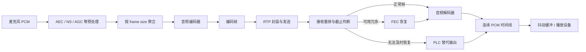

# 音频编解码

> [!tip] 阅读提示
> **前置：** [[PCM 与采样]] 初读区。
> **初读：** 读到「初读到此为止」就停。弄清：音频编解码在整条链的位置，以及「帧时长 / 码率 / 复杂度」在换什么。
> **深入：** 数据结构与契约、处理步骤、误区与观测，对照 [[Opus]] 细读。

## 一句话说明

音频编解码器把 PCM 样本转换为更紧凑的编码帧，再在接收端恢复为可播放样本。RTC 关心的不只是压缩率，还包括算法延迟、帧长、码率可调性、丢包时的替代输出、CPU/功耗和设备互操作。

## 先记住这三句

1. 音频编解码 = 把 PCM **压成可传输的压缩帧**，收端再解回可播放 PCM（或直接给播放器）。
2. RTC 里常见权衡：**帧时长**（如 20 ms）、**码率**、**延迟**、**抗丢包**（PLC/in-band FEC）；不是只追求最高音质。
3. 编解码器状态（采样率、声道、DTX/FEC）要与 SDP/RTP 负载一致；只换编码器名不够。

## 定义

编码器输入通常是带采样率、声道布局和样本格式的 PCM 帧，输出带帧边界和编码状态的压缩数据；解码器输出的 `nb_samples`、采样格式和时间戳可能与输入边界不同。语音、音乐、文件和互动媒体的优化目标不同，不能只按“码率越低越好”评价。

## 核心机制

- 采样率、位深、声道数、frame size、码率、复杂度和 lookahead 共同决定质量、带宽与算法延迟。PCM 与采样负责描述输入样本和时长。
- 有损编码通常结合心理声学、预测、变换、量化和熵编码；Opus 与 AAC 的工具、帧长和接口语义不同，不能用一个编码器的经验推断另一个。
- 解码端遇到缺包时，PLC、带内 FEC、FEC 和 RTX 分别承担不同职责；输出还要进入抖动缓冲和播放时钟。

**图在说什么：** 麦克风 PCM 先过预处理再编码发包；收端按截止判断后解码，赶不上就 PLC。

编码帧是 codec 的媒体单元，RTP 包是网络传输单元，两者不必一一对应。接收端最终追求的是在播放截止前给出连续 PCM；正常解码、FEC 和 PLC 必须分开统计，不能都记作“收到音频”。

## 具体例子

纯语音链路可先固定 48 kHz 单声道、20 ms 帧、Opus 中等码率，在无设备环境用 PCM 文件做闭环。先验证样本计数和 RTP timestamp，再注入 5% 随机丢包与 100 ms 突发丢包，分别记录 PLC、FEC、延迟和听感，最后再加入动态码率。

---

> [!warning] 初读到此为止
> 上面这些已经够第一次阅读。下面是工程展开与排障细节（字段、参数、误区与观测），**第二轮或遇到具体问题时再读**；第一次直接点文末「第一次阅读下一站」即可。

## 工程要点

- 明确每次编码/解码调用的每声道样本数、输入输出格式、返回值、内部缓存和 flush 语义；将编码帧边界与 RTP 包边界分开。
- 码率改变、DTX、FEC 和复杂度调整应配合拥塞控制和端到端质量指标验证。记录编码码率、有效负载码率、修复流量和丢包隐藏时长。
- 多线程接入时，编码器状态不能跨流共享；回调、队列和关闭顺序要保证 codec context 仍存活。
- 质量测试至少覆盖静音、语音、音乐、突发响度、采样率切换、随机/突发丢包和长时间时钟漂移。

## 问题边界

- 编码器只负责压缩域和样本域之间的转换；RTP 打包、网络重传、抖动缓冲、音频前处理和设备播放各有独立状态。
- “支持某编码器”至少包含输入格式、输出 profile、帧长、动态码率、丢包处理、线程模型和终端互操作，不应只看能否创建对象。
- 文件编码更重视压缩率和离线质量，RTC 编码还要受播放截止时间、瞬时带宽和 CPU 预算约束。

## 数据结构与契约

编码接口的最小契约应写清：每声道输入样本数、采样率、声道布局、sample format、输出 buffer 上限、返回值、是否内部缓存、flush 方式以及时间戳归属。解码接口还要说明缺包输入、FEC/PLC 选择和输出样本数。

| 阶段 | 输入 | 输出 | 主要状态 |
| --- | --- | --- | --- |
| 采集/前处理 | 设备 PCM | 清洁 PCM | AEC、NS、AGC、时钟 |
| 编码 | PCM frame | 编码 frame | 预测/窗口/码率控制 |
| RTP 封装 | 编码 frame | RTP payload | 序号、时间戳、MTU |
| 接收恢复 | payload/缺包 | 可解码 frame | 重排、FEC、PLC |
| 解码/播放 | 编码 frame | PCM frame | 解码器状态、播放时钟 |

## 通用处理步骤

1. 固定输入输出格式，并在边界转换处记录样本数和时间戳。
2. 按编码器要求聚合样本，检查输出 buffer 和最大帧时长。
3. 以编码帧而非网络包作为质量与算法延迟统计单位。
4. 接收端先验证 RTP 序号、时间戳、payload 长度和协商参数，再调用解码器。
5. 对正常帧、FEC、PLC、静音和解码错误分别统计，最后再送播放设备。

## 时间与缓冲关系

编码帧时长、编码器 lookahead、RTP 发送队列、网络到达抖动、解码器缓存和播放设备 buffer 共同构成端到端延迟。音频队列应按“样本数 + 时长 + 字节数”限制；只限制包数会因码率变化失真，只限制字节数又无法直接说明可播放时长。

## 关键参数与取舍

- frame size：短帧降低交互和恢复粒度，长帧降低包率但增加单次损伤。
- target bitrate：需要与拥塞控制的估计带宽、修复流量和其他媒体共享预算。
- complexity/quality：高复杂度可能改善低码率质量，却压缩实时 CPU 余量。
- FEC/PLC/DTX：分别改变冗余、替代输出和静音期间流量，不能用一个“丢包率”指标概括。

## 常见误区与故障

- 将 RTP 包当成音频帧：编码帧可能被聚合、分片或重传，包边界不是样本边界。
- 只改变采样率字段：必须真正重采样，否则播放速度、音高和时间戳都会错误。
- 发生丢包就无限等待重传：超过播放截止时间后，PLC/FEC 或丢弃通常比增大延迟更合理。
- codec context 在回调仍运行时释放：关闭流程应先停止输入和调度，再排空/取消，最后销毁状态。

## 可观测与验证

- 每秒记录输入/输出样本、编码帧数、payload bytes、平均/峰值码率、编码耗时、队列时长、PLC/FEC 率和设备欠载。
- 让同一片段分别通过理想网络、乱序、随机丢包、突发丢包、带宽骤降和长时钟漂移，比较音频隐藏、延迟和 CPU。
- 保存 codec 配置、版本、平台、采样率、声道、帧长和测试种子；否则不同实现的质量结果不可复现。

## 阅读导航

- **上一篇：** [[00-知识地图/专题说明/07 音频处理与 Opus|07 音频处理与 Opus]]（回到本专题说明）
- **下一篇：** [[AAC]]
- **所属专题：** [[00-知识地图/专题说明/07 音频处理与 Opus|07 音频处理与 Opus]]
- **回看：** [[RTC 知识总览]] · [[00-知识地图/学习路线/学习进度模板|学习进度]] · [[00-知识地图/学习路线/RTC 工程师学习路线.canvas|阶段路线]]

- **第一次阅读下一站：** [[AAC]]

> 读完先回所属专题做练习/验收，再点下一篇。内部链接最多再追一层；不影响理解的陌生词先记下。

## 图谱关系

- 主题：[[音频技术地图]]
- 输入：[[PCM 与采样]]
- 原理：[[心理声学与 MDCT]]
- 代表：[[Opus]]、[[AAC]]

## 参考资料

- 《Opus API 1.1.3》，§4.1、§4.2、§4.6，`90-参考资料\音视频与 WebRTC 书库\opus-api-1-1-3\translation`。
- 《AAC 音频解码原理》，编码工具与解码流程，`90-参考资料\音视频与 WebRTC 书库\aac-decoding-principles-zh\content\00-aac-decoding-principles.md`。
- 《FFmpeg Basics》，第 16 章数字音频，`90-参考资料\音视频与 WebRTC 书库\ffmpeg-basics\translation\17-digital-audio.md`。
