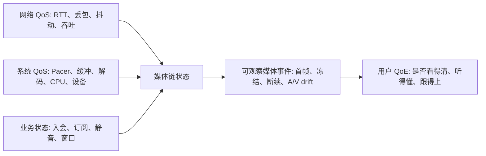

# QoS 与 QoE

> [!tip] 阅读提示
> **前置：** [[WebRTC Stats]]。
> **初读：** 先读「一句话说明」「问题边界」和「核心机制」，弄清客观指标与主观体验如何关联。
> **深入：** 「工程要点」「常见误区与故障」「观测与验证」在实现、联调或排障时再读。

## 一句话说明

QoS 描述网络和系统提供服务的客观质量，QoE 描述用户实际感受到的可用性、流畅度、清晰度和交互自然度。两者要关联分析，但不能用单个网络指标直接替代体验结论。

## 问题边界

- **上游：** RTP/RTCP、[[WebRTC Stats]]、抓包、应用与设备日志、用户体验事件。
- **下游：** 产品告警、弱网策略验收、A/B 与回归结论、排障假设。
- **易混淆：**
  - 丢包↑ ≠ 一定卡顿；码率↓ ≠ 一定拥塞（还需缓冲、解码、CPU、应用受限、SFU）。
  - RTT ≠ 端到端播放延迟（后者含采集、编码、Pacer、网络、缓冲、解码、渲染）。
  - Stats `jitter` ≠ Jitter Buffer 毫秒长度。
  - 累计计数 ≠ 区间速率/丢包率（必须两采样点做差）。
  - 本篇不展开具体拥塞公式或缓冲算法；机制见 [[拥塞控制]]、[[延迟趋势与过载检测]]。

## 核心机制

### 常见指标分层

| 层 | 典型指标 |
| --- | --- |
| QoS | RTT、到达间隔抖动、区间丢包、收/发码率、Pacer 队列、反馈延迟 |
| QoE | 首帧时间、卡顿/冻结、音频断续、音画同步、清晰度、交互响应、通话成功率 |

指标应按会话阶段、媒体方向、流/用户、网络类型和统计窗口分层；累计值与区间值不能混用。

这不是一个可用单公式替代的单向因果链。相同网络丢包可能被 FEC/PLC 吸收，也可能击中关键参考帧造成长时间黑屏；相同冻结也可能来自网络、解码器、渲染或设备。因此要在同一方向和时间窗口内对齐各层证据。

### 端到端流程

1. 采集端记录采集、编码、发送和应用排队时间；传输层记录包大小、序号、到达、RTT、丢包和抖动。
2. 接收端记录缓冲等待、恢复、解码、渲染和播放状态，并将原始统计按会话、方向、流和时间窗口聚合。
3. 诊断层把网络指标与媒体状态对齐，例如某段冻结是否同时发生缓冲欠载、解码耗时增长或发送码率下降。
4. 产品层再把首帧、冻结率、音频断续、音画同步和交互响应映射到用户可感知的 QoE，而不是直接把单个 QoS 指标当结论。

### 常见字段与计算

- `packetsSent/Received/Lost`、`bytesSent/Received` 属于计数或累计量；区间码率和区间丢包率必须用两个采样点做差。
- `jitter` 通常是接收端到达间隔抖动估计，单位和定义由统计规范决定。
- `roundTripTime` 反映某条反馈路径的往返估计，不等于端到端播放延迟。
- 冻结时长、解码帧数、丢弃帧、首帧时间和音频欠载要与同一媒体方向和时间窗口关联，避免跨流相加。

### 数值示例

某 10 秒窗口接收字节从 1,000,000 增到 2,000,000，区间接收速率约为 `1,000,000 × 8 / 10 = 800 kbit/s`。若累计丢包从 100 增到 120，不能直接写成 20% 丢包；还需该窗口扩展序号总数、重复包、晚到包和修复包口径。

若 RTT 只有 30 ms 但播放延迟达 300 ms，应优先检查 Pacer/接收缓冲/解码排队；若 RTT 上升而播放延迟稳定，说明缓冲或降码率可能吸收了网络变化，但不代表体验没有代价。

### 诊断边界

丢包增加不一定等于卡顿，码率降低也不一定代表拥塞；还要结合抖动缓冲欠载、解码耗时、设备 CPU、应用受限和 SFU 策略。先建立基线，再用弱网场景验证恢复和降级是否改善用户指标。

| 现象 | 先看 QoS | 再对齐 QoE / 媒体 |
| --- | --- | --- |
| 画面冻结 | 区间丢包、到达间隔、发送码率 | 缓冲欠载、关键帧、解码耗时 |
| 声音断续 | 音频丢包、抖动 | NetEQ 欠载、设备路由切换 |
| 互动迟钝 | RTT、Pacer 队列 | 端到端播放延迟分解 |
| 画质糊但流畅 | 码率/层下降 | 是否主动降级、订阅层变化 |

## 工程要点

- 所有指标标明累计/区间、单位、媒体方向、流和采样窗口。
- 能把一次冻结关联到缓冲、恢复、解码、渲染或网络队列中的具体阶段。
- 同时报告平均值与高百分位（P50/P95/P99），避免短时峰值被平均数掩盖。
- QoE 结论注明样本量与置信范围；小样本单次冻结不能代表整体网络质量。
- 相同用户体验事件保留原始时间戳，便于与网络反馈和媒体状态对齐。
- 分层分析纳入分辨率、帧率、音频帧长、设备和网络类型。
- 优化后同时检查延迟、画质、冻结、音频连续性和额外流量副作用。

## 常见误区与故障

| 误区 / 故障 | 表现与排查 |
| --- | --- |
| 平均码率越高 QoE 越好 | 突发、冻结、音频断续、互动响应更敏感 |
| 丢包率为零就无网络问题 | 队列延迟、突发抖动、反馈滞后、MTU/分片仍可卡顿 |
| Stats 接收正常但用户黑屏 | 查关键帧/解码器/渲染/时间线，勿只看 packetsReceived |
| QoE 报警与 QoS 错位 | 查采样窗口、媒体方向、累计/区间转换、客户端时钟 |
| 优化只盯丢包 | 还要查延迟、画质、冻结、音频连续性与额外流量 |
| 跨流相加冻结时长 | 必须按方向/流/窗口对齐后再聚合 |

## 观测与验证

每次实验固定版本、分辨率、帧率、音频帧长、网络模型和统计窗口，保存 Stats、抓包、应用日志和用户体验事件。

**至少比较六类场景：** 理想网络、随机丢包、突发丢包、带宽骤降、CPU 受限、网络切换；报告分布而非只报平均值。

**最小验收：**

- 指标口径完整（累计/区间、单位、方向、流、窗口）。
- 一次冻结可关联到具体阶段。
- 同时有均值与高百分位。
- 报告保留网络/媒体参数、版本、重复次数和基线。

**复盘问题：** 每个 QoE 事件能否关联同时间窗 QoS？丢包/码率/jitter/RTT 是累计还是区间？分辨率/帧率/设备/网络是否分层？异常能否用抓包/日志/复现实验证明？

对照 [[端到端延迟]]、[[弱网对抗]]、[[延迟趋势与过载检测]]。

## 阅读导航

- **上一篇：** [[TWCC]]
- **下一篇：** [[RTCP 报文计算与调度状态机]]
- **所属专题：** [[00-知识地图/专题说明/10 RTCP 与质量反馈|10 RTCP 与质量反馈]]
- **回看：** [[RTC 知识总览]] · [[00-知识地图/学习路线/学习进度模板|学习进度]] · [[00-知识地图/学习路线/RTC 工程师学习路线.canvas|阶段路线]]

> 读完先回所属专题做练习/验收，再点下一篇。内部链接最多再追一层；不影响理解的陌生词先记下。

## 图谱关系

- 输入：[[WebRTC Stats]]
- 约束：[[端到端延迟]]
- 输出：[[弱网对抗]]
- 观测：[[延迟趋势与过载检测]]
- 相关：[[拥塞控制]]

## 参考资料

- 《WebRTC 权威指南（原书第 3 版）》第 10.2.3 节的 RTP/RTCP 观测与抓包说明，`90-参考资料/音视频与 WebRTC 书库/webrtc-authoritative-guide-zh/content/10-protocols.md`
- 《WebRTC 中文专题参考资料》NetEQ 论文第五章“基于语音质量评估的 NetEQ 改进”，`90-参考资料/音视频与 WebRTC 书库/webrtc-reference-zh/content/10-neteq-chapter-5.md`
