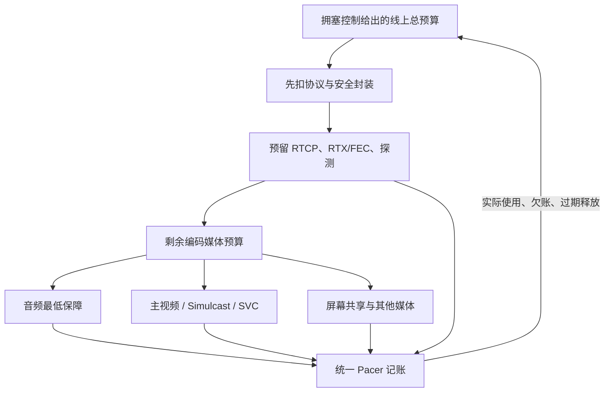

# 带宽分配

> [!tip] 阅读提示
> **前置：** [[GCC]]、[[丢包恢复策略]]。
> **初读：** 先读「一句话说明」「问题边界」和「核心机制」，弄清预算口径与优先级。
> **深入：** 「工程要点」「常见误区与故障」「观测与验证」在实现、联调或排障时再读。

## 一句话说明

带宽分配把拥塞控制给出的目标速率拆成可执行的线路预算，而不是把目标值原样交给编码器。线上总速率至少包括媒体、重传、FEC、padding/探测、RTCP 和各层封装开销。

## 问题边界

- **上游：** [[GCC]] / [[拥塞控制]] 输出的目标速率、应用优先级与上下限、SFU 订阅策略。
- **下游：** 编码器目标、分层选择、[[Pacing]] 各类额度、修复/探测配额。
- **易混淆：**
  - 编码媒体码率 ≠ 线上总码率（后者含封装、RTCP、RTX/FEC、探测）。
  - 平均分配 ≠ 公平（音频最低保障、屏幕共享交互、视频层优先级通常不同）。
  - 「编码器未超目标」≠「线路未超预算」（漏算开销会推高 Pacer 队列）。
  - 本篇不展开 GCC 滤波公式或编码器内部 QP 控制；联动细节见 [[编码器与 BWE-Pacing 联动]]。估计策略见 [[带宽估计]]。

## 核心机制

```text
总发送预算
  = 原始媒体 + RTX/重传 + FEC/冗余 + padding/探测 + RTCP/协议开销
编码器可用码率
  = 总发送预算 - 非编码流量的预留
```



同一个字节只能在总预算中记一次。预留表示允许使用的额度，不是要求每轮都把它发满；未使用额度、关键帧债务和过期恢复包都应有明确归还或摊还规则。

### 端到端流程

1. 拥塞控制给出某个时间窗口的目标线上预算，应用层提供音频、视频、屏幕共享和数据流的优先级/上下限。
2. 分配器先为 RTCP、协议/安全封装、RTX/FEC、padding/探测预留额度，再把剩余预算交给编码器和分层选择。
3. Pacer 按各类流量的额度和截止时间发包，并回报实际使用；未使用额度、超限和过期包进入下一轮调整。
4. 观测层比较目标、实际、队列和 QoE，判断是网络受限、某流超卖、修复开销过高还是应用未产出。

### 预算口径

| 项目 | 说明 |
| --- | --- |
| 统计窗口 | 必须先声明窗口与字节单位（kbit/s 还是字节/窗） |
| 线上总码率 | RTP/RTCP/SRTP/IP/UDP/隧道字节从同一预算扣除 |
| 媒体预算 | `media = on_wire − overhead − repair − probe − feedback` |
| 动态预留 | 音频连续性、关键帧、恢复截止、多流优先级可调 |
| 记账标签 | 每包带类别、流、优先级，避免重复计费或漏计 |

预留不是无限固定比例；音频连续性、关键帧、恢复截止和多流优先级可能需要动态调整。任何模块产生的额外包都必须带类别、流、优先级和预算消耗。

### 数值示例

若线上目标为 2,000 kbit/s，协议/安全开销 120、RTCP 20、RTX/FEC 200、探测 100，则编码媒体预算约为 `2,000 − 440 = 1,560 kbit/s`。若把 2,000 直接交给编码器，线上负载必然超过目标。

一个 1,200 kbit/s 视频层与 80 kbit/s 音频共存时，应先保障音频和交互关键流，再在视频层间按订阅、分辨率和切换成本分配，而不是按比例硬切。

若关键帧突发需要额外 300 kbit/s 持续 200 ms，应记为一次性预算债务并在随后数帧摊还，而不是与稳态层码率混为一谈。

## 多流与优先级

- 先按音频、主视频、辅视频、屏幕共享和数据通道设定最低保障与上限，再在可用余量中分配分层编码空间。
- Simulcast/SVC 切换应把层码率、关键帧成本和切换突发纳入预算，不能只比较稳态码率。
- 过载时优先保护仍有播放价值的媒体，降低层级或丢弃过期修复包；恢复流量要有配额，不能无限挤占新媒体。
- 数据通道与屏幕共享的截止时间语义不同：交互关键更新优先于可延迟的大块传输。

| 流量类 | 典型策略 |
| --- | --- |
| 音频 | 最低保障优先，几乎不与视频抢截止 |
| 主视频 | 余量主体；层切换考虑关键帧成本 |
| 辅视频 / 屏幕 | 清晰度或交互优先，按场景定上下限 |
| RTX/FEC | 有上限与截止；过期释放额度 |
| padding/探测 | 占用时同步下调媒体预算 |

## 工程要点

- 分配器维护总预算、已承诺预算、实际发送、欠账、流优先级、最小/最大码率和时间窗。
- Simulcast/SVC 层切换要把新层关键帧或刷新突发纳入一次性预算。
- 恢复流量要有上限和截止时间；过期 RTX/FEC 应释放额度给后续新媒体。
- SFU 订阅变化、编码器不可达码率和 Pacer 背压都应反馈给分配器，而不是悄悄突破总预算。
- 与 [[编码器与 BWE-Pacing 联动]] 对齐：新预算必须在下一帧边界真正生效，旧回调不能覆盖新目标。
- 降预算要快、升预算要慢，并与控制器增减策略一致，避免振荡。

## 常见误区与故障

| 误区 / 故障 | 表现与排查 |
| --- | --- |
| 分配=给编码器设码率 | 线路还承载修复、反馈、探测和封装 |
| 按流平均即公平 | 音频保障、屏幕交互、视频层优先级不同 |
| 编码未超限但线上拥塞 | 查漏算封装、关键帧、RTX/FEC、padding |
| 一条流码率突然归零 | 查优先级、层切换、应用受限、预算借用/归还 |
| 探测“成功”媒体过载 | 探测额度占用时媒体预算未同步下调 |
| 目标很高实际很低 | 分开看应用受限、层选择、CPU 与 Pacer 背压 |

## 观测与验证

按时间窗记录：总预算、媒体/音频/视频/修复/反馈/探测/封装字节、各流目标与实际、Pacer 队列和丢弃原因。同时记录 GCC 目标、应用约束、SFU 订阅与封装开销，才能解释“目标高但发送低”或“编码正常但队列增长”。

**实验覆盖：** 单流、多流、Simulcast 切换、关键帧、突发丢包、带宽阶跃。

**成功标准：** 总和不超过线上预算；优先级符合预期；目标—实际—队列可同时间轴对齐。对照 [[WebRTC Stats]]、[[QoS 与 QoE]]。

## 阅读导航

- **上一篇：** [[编码器与 BWE-Pacing 联动]]
- **下一篇：** [[延迟趋势与过载检测]]
- **所属专题：** [[00-知识地图/专题说明/12 丢包恢复、带宽估计与拥塞控制|12 丢包恢复、带宽估计与拥塞控制]]
- **回看：** [[RTC 知识总览]] · [[00-知识地图/学习路线/学习进度模板|学习进度]] · [[00-知识地图/学习路线/RTC 工程师学习路线.canvas|阶段路线]]

> 读完先回所属专题做练习/验收，再点下一篇。内部链接最多再追一层；不影响理解的陌生词先记下。

## 图谱关系

- 输入：[[GCC]]
- 输出：[[Pacing]]
- 约束：[[拥塞控制]]
- 输入：[[丢包恢复策略]]
- 实现：[[Simulcast]]
- 相关：[[编码器与 BWE-Pacing 联动]]

## 参考资料

- 《WebRTC 的拥塞控制和带宽策略》第 2.2—2.4 节“budget、pacer 延迟、padding”和第 3.4 节“FEC 与码率分配”，`90-参考资料/音视频与 WebRTC 书库/livevideostack-webrtc-congestion-control-zh/content/00-webrtc-congestion-control.md`
- 《WebRTC 权威指南（原书第 3 版）》第 10.2.3 节关于 RTP 包大小、媒体包与传输的说明，`90-参考资料/音视频与 WebRTC 书库/webrtc-authoritative-guide-zh/content/10-protocols.md`
