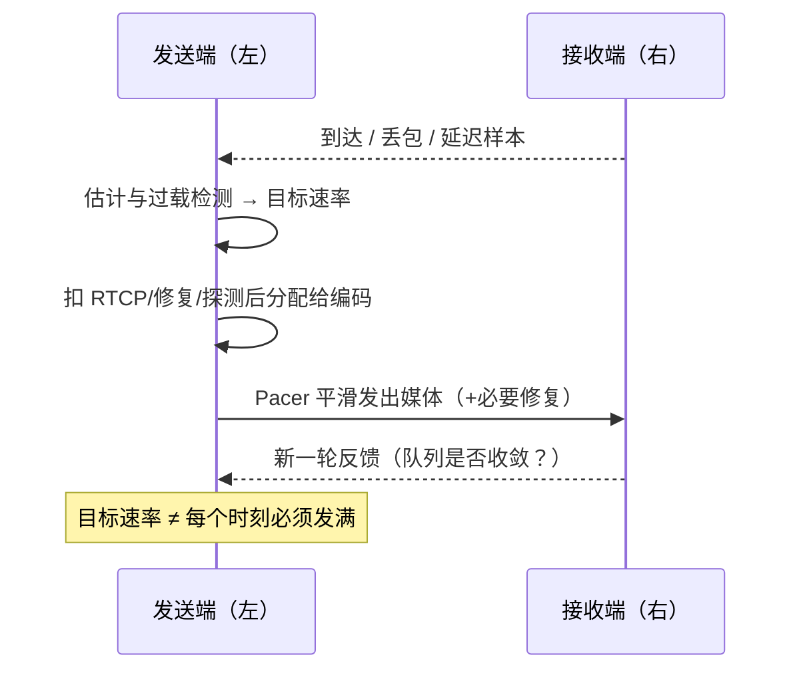

# 拥塞控制

> [!tip] 阅读提示
> **前置：** [[带宽估计]]。
> **初读：** 读到「初读到此为止」就停。弄清：反馈→估计→目标速率→分配→Pacer 的闭环，以及「不是把 UDP 变 TCP」。
> **深入：** 工程要点、误区表与验收清单，联调/排障时再读。

## 一句话说明

拥塞控制根据网络反馈和带宽估计调节发送速率，尽量避免持续排队、延迟膨胀和大规模丢包，同时利用当前可用容量。UDP 不会替应用完成这项工作；发送端必须明确反馈、估计、速率和调度的责任边界。

## 先记住这三句

1. 拥塞控制 = 用反馈把**发送速率**压在路径能扛住的范围内，少排队、少延迟膨胀、少大面积丢包。
2. UDP **不会**替你做这件事；闭环是：反馈 → 估计/过载 → 目标速率 → 分配（扣开销）→ 编码/分层 → Pacer。
3. 实际发送低于目标，不一定是网络过载——也可能是应用/CPU/编码器受限（ALR）。

## 问题边界

- **上游：** [[带宽估计]]、TWCC/RTCP 反馈、延迟趋势、丢包、应用产出与队列状态。
- **下游：** 编码目标/层选择、[[带宽分配]]、[[Pacing]]、修复比例与探测。
- **易混淆：**
  - 拥塞控制 ≠ 把 UDP 变成 TCP（实时媒体可丢弃过期数据，目标函数不同）。
  - 所有降码率 ≠ 网络控制（应用无数据、CPU、编码器限制、订阅层变化也会降发送）。
  - 目标速率 ≠ “每个时间点必须发满”的硬命令。
  - 实现路线之一是 [[GCC]]；本篇讲问题与闭环，不展开单一滤波公式或估计细节（见 [[带宽估计]]）。

## 核心机制


### 控制手段

- 根据估计输出调整编码目标码率、分辨率、帧率或选择 Simulcast/SVC 层。
- 通过 Pacer 平滑包发送，观察队列和延迟趋势。
- 为 RTX、FEC、padding、探测和 RTCP 预留预算；拥塞期间不能为了恢复而无限增加额外流量。

### 端到端闭环

1. 接收端和发送端采集到达时间、丢包、吞吐、RTT、反馈年龄和队列状态。
2. 带宽估计与过载检测将样本转换为增长、保持或下降状态，并输出一个带边界的目标速率。
3. 带宽分配先扣除 RTCP、修复、探测和协议开销，再把剩余预算交给编码器和分层选择。
4. Pacer 按目标速率发送新媒体和必要的修复包；下一轮反馈验证队列是否收敛、体验是否改善。

**图在说什么：** 左右对打形成「反馈 → 估计 → 目标 → 分配 → 发送」闭环；这不是把 UDP 改成 TCP，过期媒体可以丢。



文字版同一条闭环：

```text
反馈样本 -> 估计/过载检测 -> 目标速率
  -> 分配（扣开销/修复/探测）
  -> 编码与分层 -> Pacer 发送
  -> 新反馈
```

### 数值示例

假设线路目标预算为 2 Mbit/s，其中协议/RTCP 100、RTX/FEC 200、探测 100 kbit/s，则编码媒体初始预算约为 1.6 Mbit/s。若队列延迟持续增长，应先降低媒体或探测预算，而不是把修复包直接叠加在 2 Mbit/s 之上。

当应用只有 500 kbit/s 新视频可发，即使估计目标是 2 Mbit/s，实际发送仍可能只有 500 kbit/s 加控制流量；这属于应用受限候选，不能直接按网络过载降码率。

容量从 2 Mbit/s 骤降到 800 kbit/s 时，成功的控制器应先让 Pacer 队列与丢包收敛，再谈画质恢复；若降目标后队列仍涨，优先查未入账的修复/关键帧/封装开销。


---

> [!warning] 初读到此为止
> 上面这些已经够第一次阅读。下面是工程展开与排障细节，**第二轮或遇到具体问题时再读**；第一次直接点文末「第一次阅读下一站」即可。

## 深入：状态表与稳定性

### 输入、状态与控制量

| 类别 | 内容 |
| --- | --- |
| 输入 | TWCC/RTCP、区间丢包、接收速率、延迟趋势、Pacer 排队、应用产出 |
| 状态 | 目标速率、增长/保持/下降、上次有效反馈、最小/最大码率、应用受限、探测阶段 |
| 控制量 | 编码目标、分辨率/帧率、Simulcast/SVC 层、修复比例、Pacer 速率、优先级 |
| 约束 | 播放截止、端到端延迟、CPU、链路公平性、媒体最低质量、额外流量预算 |

### 稳定性边界

响应速度、稳定性、公平性、画质和端到端延迟之间存在取舍。应用受限或编码器无数据时，实际发送低于目标并不自动证明网络拥塞；应把 GCC 状态、Pacer 队列、编码输出和体验指标放在同一时间窗口比较。

## 工程要点

- 接收侧按报告窗口计算区间指标，明确乱序、晚到和修复后的统计口径；发送侧保存逐包时间和大小以配对反馈。
- 控制器限制增速、降速和状态切换频率，设置滞回和保护下限；过期反馈不得覆盖更新鲜样本。
- 编码器、分层器、Pacer、RTX/FEC 和 RTCP 都应从统一预算视图读取额度，避免模块间互相超卖。
- 多流场景考虑音频最低保障和不同视频层优先级；公平性不是只把总码率平均分配。
- 一轮控制日志应能串起反馈、估计、分配、Pacer 和实际发送。
- 应用受限、CPU 受限和网络受限给出不同原因码。
- 与 [[编码器与 BWE-Pacing 联动]] 对齐：目标变化必须版本化传到编码线程。

## 常见误区与故障

| 误区 / 故障 | 表现与排查 |
| --- | --- |
| 拥塞控制=把 UDP 变 TCP | 实时媒体允许丢弃过期数据，反馈与恢复机制不同 |
| 所有降码率都是网络控制 | 查应用无数据、CPU、编码器限制、订阅层变化 |
| 码率来回振荡 | 查反馈滞后、趋势阈值、Pacer 队列、控制周期 |
| 降码率后队列仍增长 | 查未计入的 RTX/FEC/关键帧/协议开销和 socket 背压 |
| 容量恢复后二次突发 | 查探测、关键帧或修复流量叠加 |
| 多流“均分”拖垮交互 | 音频/主视频优先级未落地 |

## 观测与验证

每轮记录：输入样本、控制状态、目标/实际码率、各流预算、Pacer 队列、修复字节、应用受限原因和 QoE。

**实验：** 固定容量、容量骤降、恢复、竞争流、应用空闲；检查是否收敛、是否过冲、恢复后延迟是否回落。

**最小验收：**

- 总线上线字节不超过目标预算，协议/修复/探测开销有独立统计。
- 容量阶跃和反馈丢失时有界收敛，不产生持续振荡。
- 三类受限原因可区分。

**复盘问题：** 目标与线上字节是否同口径？一次降速能否追溯到反馈窗口与状态？恢复后是否二次突发？应用/CPU/Pacer/公网过载是否有不同观测？

对照 [[QoS 与 QoE]]、[[GCC]]、[[GCC 探测与码率控制状态机]]。

## 阅读导航

- **上一篇：** [[GCC]]
- **下一篇：** [[GCC 探测与码率控制状态机]]
- **第一次阅读下一站：** [[带宽估计]]
- **所属专题：** [[00-知识地图/专题说明/12 丢包恢复、带宽估计与拥塞控制|12 丢包恢复、带宽估计与拥塞控制]]
- **回看：** [[RTC 知识总览]] · [[00-知识地图/学习路线/学习进度模板|学习进度]] · [[00-知识地图/学习路线/RTC 工程师学习路线.canvas|阶段路线]]


> 读完先回所属专题做练习/验收，再点下一篇。内部链接最多再追一层；不影响理解的陌生词先记下。

## 图谱关系

- 输入：[[带宽估计]]
- 实现：[[GCC]]
- 输出：[[Pacing]]
- 约束：[[带宽分配]]
- 观测：[[QoS 与 QoE]]

## 参考资料

- 《WebRTC 的拥塞控制和带宽策略》第 1 节“estimator”、第 2 节“pacer”和第 5 节“feedback”，`90-参考资料/音视频与 WebRTC 书库/livevideostack-webrtc-congestion-control-zh/content/00-webrtc-congestion-control.md`
- 《WebRTC 权威指南（原书第 3 版）》第 10.2.11 节“UDP 协议”，`90-参考资料/音视频与 WebRTC 书库/webrtc-authoritative-guide-zh/content/10-protocols.md`；第 11 章“IETF 文档”，`90-参考资料/音视频与 WebRTC 书库/webrtc-authoritative-guide-zh/content/11-ietf-documents.md`
