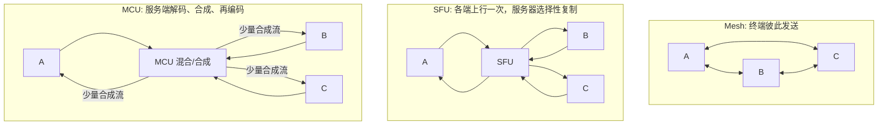

# WebRTC 拓扑选择

> [!tip] 阅读提示
> **前置：** [[RTC]]、[[数据面与控制面]]。SFU/MCU 细节可后读。
> **初读：** 读到「初读到此为止」就停。弄清 Mesh / SFU / MCU 谁复制媒体、谁解码，以及选型看「同时可见人数」不是房间总人数。
> **深入：** 混合拓扑、容量算例与验收，做架构或压测时再读。

## 一句话说明

Mesh、SFU 和 MCU 决定媒体在多方会话中由谁复制、是否解码，以及每个端点承担多少上行、下行和计算成本。选型看的是**峰值可见人数与终端能力**，不是“有没有服务器”这句话。

## 先记住这三句

1. **Mesh**：大家互发；人一多，终端上行和连接数先爆。
2. **SFU**：每人上行一次，服务器按订阅转发（通常不解码混合）；终端仍要解多路。
3. **MCU**：服务器解码再合成；终端下行省，但服务端算力和延迟更高。选型看峰值可见人数与终端能力。

## 核心机制

1. **Mesh：** 终端互发，部署简单，上行与连接数随 `N` 涨。  
2. **SFU：** 集中收、选择性转发，保留独立码流；终端多路解码与布局。  
3. **MCU：** 集中解码/混合/再编码，终端收合成流；服务端算力与处理延迟更高。  
4. 真实产品常**混合**：音频混、视频转；边缘接入 + 跨区级联。

**图在说什么：** Mesh 彼此直连上行多；SFU 各端上行一次由服务器选转；MCU 则解码合成后再出——成本与能力不同。



图只表达媒体复制与处理位置，不代表信令路径。Mesh 仍可有信令服务器；SFU 的下行通常按订阅选择而非把所有输入无条件广播；MCU 输出的是重新编码的新媒体时间线。

## 三种拓扑怎样消耗资源

设房间有 `N` 个参与者，每人发布一路音视频：

| 拓扑 | 发送端上行 | 接收端下行 | 服务端媒体处理 | 主要增长项 |
| --- | --- | --- | --- | --- |
| Mesh | 约发 `N-1` 份 | 收 `N-1` 路 | 通常只信令 | 终端连接数与上行 |
| SFU | 通常 1 组编码层 | 按订阅多路 | 传输层解密、检查、转发 | 带宽、包速率、终端解码数 |
| MCU | 通常 1 路 | 通常 1 路合成 | 解码、混合、布局、重编码 | 编解码算力与处理延迟 |

Simulcast 让发布者上传多层；选择性订阅降低 SFU 下行；音频混 + 视频转可组成混合拓扑。表是典型行为，不是固定公式。

粗算直觉（仅量级）：

```text
Mesh uplink ~ (N-1) * bitrate
SFU fanout ~ subscribers * selected_layers
MCU cost  ~ decode_N + mix + encode_out
```

## 决策流程

1. 定**同时可见/可听**上限，不只看房间总人数。  
2. 估最弱终端：并发解码路数、可承受下行。  
3. 是否要固定合成画面、SIP 互通、服务端内容分析、统一录制。  
4. E2EE 边界：服务端必须解码的 MCU 与内容不可见的 E2EE 往往冲突。  
5. 按峰值订阅矩阵估带宽、包速率、编解码算力、跨区流量。  
6. 用目标终端 + 真实弱网复测首帧、切层、恢复；空房压测不够。

```text
constraints (N_visible, device, E2EE, record)
  -> pick Mesh | SFU | MCU | hybrid
  -> size capacity
  -> validate on weak clients / weak net
```

## 典型场景

| 场景 | 更常见选择 | 注意 |
| --- | --- | --- |
| 2～4 人内部、网络足 | Mesh | 移动端上行与后台限制仍要测 |
| 大班课 / 多人会 | SFU | 按布局选层；每接收端独立拥塞 |
| 固定宫格 / SIP 接入 | MCU | 转码资源与额外时延 |
| 跨地域大房间 | 边缘 SFU + 级联 | 见 [[级联与边缘节点]]，避免全量跨区复制 |


---

> [!warning] 初读到此为止
> 上面这些已经够第一次阅读。下面是工程展开与排障细节（字段、指标、状态流），**第二轮或遇到具体问题时再读**；第一次直接点文末「第一次阅读下一站」即可。


## 问题边界

- **上游：** 同时可见/可听人数、终端解码能力、上下行预算、录制/网关/E2EE 约束。
- **下游：** 拓扑形态（含混合）、容量与延迟预算、观测与降级策略。
- **易混淆：**
  - 房间总人数 ≠ 同时解码人数。  
  - SFU “不处理媒体” ≠ 不解析 RTP/不做选层与重传。  
  - MCU 终端下行省 ≠ 服务端算力与时延也省。  
  - 有媒体服务器 ≠ 一定是 MCU。
## 混合拓扑

- 音频 MCU（一路混音下行）+ 视频 SFU（多路转发）。  
- 主会场 MCU 合成给直播/录制，互动区仍 SFU。  
- 同房间内：弱端收 MCU/低层，强端收多层 SFU。  

混合时把**控制面意图**（谁听谁、看谁）与**媒体面绑定**写清，否则排障会在“到底混了还是转了”上打转。

## 工程要点

- 选型文档写清：人数、终端、布局、带宽、录制/网关、E2EE。  
- 容量用峰值订阅矩阵，不用“平均码率 × 人数”糊弄；计入关键帧、RTX、FEC、padding、协议开销。  
- 观测分终端侧与服务端侧，验收含切订阅、弱网恢复、节点故障。

## 常见误区

- “SFU 不处理媒体”：仍要解析 RTP/RTCP、映射、缓存重传、选层。  
- “MCU 一定更省带宽”：终端下行常省；入站、内部、输出规格另算。  
- “人少就 Mesh”：忽略移动上行、录制、审核。  
- “上了 SFU 就无限扩”：单节点包速率与跨区洪泛仍会炸。

## 观测与验收

- **终端：** 上下行码率、编码路数、并发解码、CPU/温度/耗电。  
- **服务端：** 入/出站包速率、复制倍数、转码实时系数、队列、恢复流量、余量。  
- **体验：** 入会、首帧、E2E 延迟、切层、卡顿、同步、故障恢复。  
- **容量场景：** 大小房混合、订阅频繁变化、网络恢复、节点故障——不只稳定满负载。

## 容量算例（示意）

10 人会议，每人看 4 路 720p 视频（不含音频开销）：

- Mesh：每人上行约 4 份 → 弱网上行先崩。  
- SFU：每人上行 1 组（可 Simulcast）；下行 4 路选层；服务端出站 ≈ 10×4 路转发量级。  
- MCU：每人上下行各 1；服务端要解 10 路再编出多路或一路合成。  

用你们真实码率表替换数字后，才能进采购/扩容决策。


## 与后续笔记怎么接

- 选定 SFU 后读 [[SFU]]、[[会议媒体路由与订阅]]、[[SFU RTP 改写与反馈翻译]]。  
- 跨区扩容读 [[级联与边缘节点]]。  
- 必须转码/合成时读 [[MCU]] 与 [[媒体服务器]] 的职责边界。  
- 验收指标对齐 [[QoS 与 QoE]]，弱网台架用 [[网络仿真]]。

## 阅读导航

- **上一篇：** [[WebRTC 会话生命周期]]
- **下一篇：** [[RTCDataChannel 与 SCTP]]
- **所属专题：** [[00-知识地图/专题说明/01 RTC 系统与低延迟目标|01 RTC 系统与低延迟目标]]
- **回看：** [[RTC 知识总览]] · [[00-知识地图/学习路线/学习进度模板|学习进度]] · [[00-知识地图/学习路线/RTC 工程师学习路线.canvas|阶段路线]]

- **第一次阅读下一站：** [[RTCDataChannel 与 SCTP]]

> 读完先回所属专题做练习/验收，再点下一篇。内部链接最多再追一层；不影响理解的陌生词先记下。

## 图谱关系

- 主题：[[服务端架构地图]]
- 实现：[[SFU]]、[[MCU]]
- 承载：[[媒体服务器]]
- 扩展：[[级联与边缘节点]]、[[会议媒体路由与订阅]]
- 评价：[[QoS 与 QoE]]

## 参考资料

- 《Learning WebRTC》第 8 章，`90-参考资料/音视频与 WebRTC 书库/learning-webrtc/translation/08-advanced-security-and-large-scale-optimization.md`
- RFC 7667，RTP Topologies
