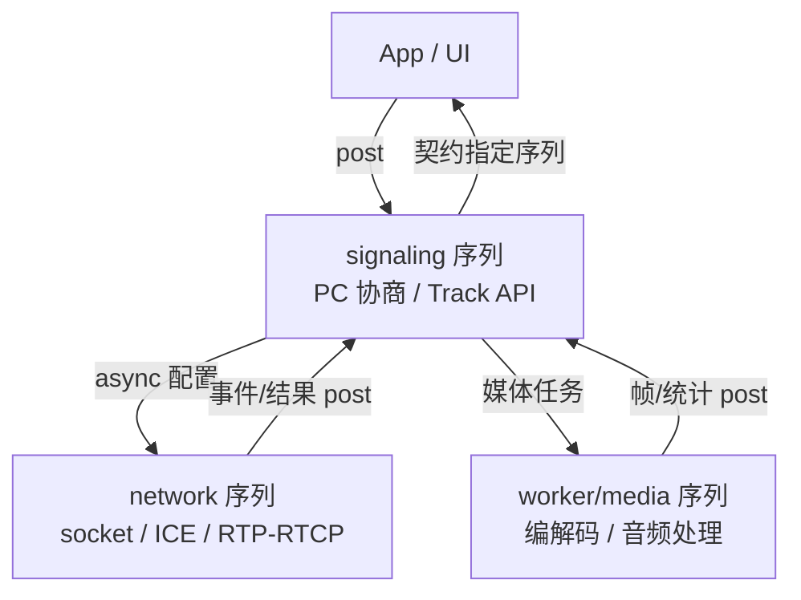

# Native WebRTC 线程模型

> [!tip] 阅读提示
> **前置：** [[客户端工程地图]]；对象侧见 [[MediaStream Track 与 Transceiver]]、[[WebRTC 会话生命周期]]。
> **初读：** 读到「初读到此为止」就停。弄清：正确性边界是**序列**，不是「永远只有三条 OS 线程」；Close 要有屏障。
> **深入：** 死锁/实时性、对象寿命与诊断，联调崩溃或关闭泄漏时再读。

## 一句话说明

Native WebRTC 把信令、网络与媒体工作分配到有明确**序列归属**的任务队列；对象创建、调用与销毁必须遵守序列约束，不能把异步回调当成任意线程上的自由函数。它解决的是并发不变量，而不是“操作系统里永远只有三条固定线程”。

## 先记住这三句

1. 正确性靠**序列归属**（TaskQueue + SequenceChecker），不是死背「信令/网络/worker 三线程」。
2. 跨序列只投递任务或传不可变快照；「碰巧在信令线程回调」≠ 契约。
3. `Close()` 返回 ≠ 资源已释放——要停源头、断回调、排空在途任务，别靠 `sleep`。

## 用一句话说清

Native WebRTC 的正确性边界是 **TaskQueue / 序列**，不是死背「三条 OS 线程名字」。跨序列只投递任务或快照，回调落在哪条序列要查契约——串错就会偶现崩溃或静音。

**第一次记住：** 别在随意线程直接拧内部对象；问「这条回调保证在哪个队列上」。

（结构图与常见踩坑在折叠线后。）



---

> [!warning] 初读到此为止
> 上面这些已经够第一次阅读。下面先是「原初读区深文」（可跳过），再是工程细节；**第一次直接点文末「第一次阅读下一站」即可。**


## 初读展开（原初读区深文，第二轮再读）

> 下面是本篇原先堆在初读区的展开内容，已整体后移，避免第一次阅读过载。

## 问题边界

- **上游：** 业务线程发起的 PeerConnection / Track / SDP 操作、设备与编解码回调、套接字与定时器事件。
- **下游：** 落在约定序列上的状态变更、observer 回调、媒体帧交付、关闭完成信号。
- **易混淆：**
  - **线程 ≠ 序列：** 同一 TaskQueue 可由线程池调度，但同一序列上的任务仍串行、保对象不变量。
  - **“碰巧在信令线程回调” ≠ 契约：** 没有接口保证就不要当永久行为。
  - **引用计数活着 ≠ 可在任意线程访问：** 寿命与序列是两件事。
  - **Close 返回 ≠ 资源已释放：** 在途任务与外部回调可能仍在飞。

## 核心机制

1. 以**序列**为正确性边界：哪些对象只能在哪个序列读写，由构造处、接口注释和 `SequenceChecker` 共同约束。  
2. 跨序列只通过**任务投递 / 消息 / 不可变快照**，避免双向同步等待。  
3. 实时媒体路径有截止时间：设备/解码回调里不做阻塞 I/O、大锁、重业务逻辑。  
4. 关闭时建**屏障**：停源头 → 断回调 → 排空或取消在途任务 → 按依赖逆序释放。  
5. 读源码固定 **WebRTC 提交**；队列名、默认线程数、对象归属会演进，旧“三线程图”只作直觉，不作真理。

## 线程、序列与任务队列

| 概念 | 含义 | 工程含义 |
| --- | --- | --- |
| 线程 | OS 调度与阻塞的执行实体 | 可被池化、可换绑 |
| 序列 | 要求任务串行、维持对象不变量的逻辑上下文 | 真正的“在哪儿访问对象” |
| 任务队列 | 投递异步/延迟工作的接口 | Post / DelayedPost 的载体 |
| 实时回调 | 有截止时间的媒体/设备路径 | 禁止阻塞与重分配风暴 |

历史叙述里常见“信令 / 网络 / worker”分工，帮助建立直觉：

```text
signaling sequence  : PeerConnection 协商与业务 API 面
network sequence    : 套接字、ICE/DTLS、RTP/RTCP 收发推进
worker / media Q    : 编解码、音频处理、部分媒体转换
```

但**具体类名、默认队列数、某对象落在哪条队列**随版本变化。稳定判据是：

- 当前接口文档与头文件注释  
- `SequenceChecker` / 线程注解在调试构建中的报错  
- 对象构造时绑定的队列，而不是博客里的固定三线程示意图  

## 常见数据流

```text
app / UI
  -> (post) signaling: CreatePC / AddTrack / SetLocalDescription
  -> (async) network: candidate / socket / RTP-RTCP
  -> worker/media: encode|decode|audio proc
  -> (post back) signaling or app queue: observer / stats / UI
```

**图在说什么：** 正确性边界是序列（TaskQueue），不是死背三条 OS 线程；跨序列只投递任务/快照，回调落点要查契约。


> （本图已上移到初读区，此处不重复。）


典型步骤：

1. 业务在约定序列（常为信令）创建或操作 PeerConnection，发起 SDP / Track 变更。  
2. 传输配置异步落到网络序列；套接字事件与 RTP/RTCP 在此推进。  
3. 编解码、音频处理、部分格式转换在 worker 或专用队列运行。  
4. 结果以任务或 observer 回到**契约指定**的序列，再更新业务状态。  

回调落点必须查当前版本契约。即便今天“总是”在信令线程，也不应在无保证时写死假设。

## 关闭流程示例

稳健顺序（API 以所用版本为准，原则稳定）：

1. 业务状态进入 `closing`，拒绝新协商与新 Track。  
2. 停止采集与发布（从源头断媒体）。  
3. 注销会继续投递任务的 observer / sink。  
4. 关闭 PeerConnection 与传输。  
5. 等待关闭回调或队列屏障（证明在途工作结束）。  
6. 最后释放工厂、设备与队列本身。  

用“`sleep` 一会儿再释放”掩盖竞态，无法证明任务已结束；偶发 use-after-free 往往出在这一步被省略。


---

## 对象所有权与异步寿命

- 任务捕获**原始指针**后，执行前对象可能已销毁 → 用项目约定的 `scoped_refptr` / 弱引用 / pending-task 安全机制。  
- 引用计数只保证“还活着”，**不保证**在正确序列访问。  
- 向业务层交付 buffer：写清共享引用、只读期限、是否允许跨线程保存。  
- 周期引用（observer ↔ PC、factory ↔ device）会让 Close 后对象仍活着，表现为设备、线程或网络 fd 不释放。

关闭的核心不是“调用一次 `Close()`”，而是：

```text
stop producing work
  -> disconnect external callbacks
  -> cancel or drain in-flight tasks
  -> release transport / media / factory in reverse dependency order
```

## 死锁和实时性风险

- **环形等待：** 序列 A 持锁并同步等 B，而 B 的任务又回调 A。  
- **UI 污染实时路径：** 设备回调里同步 `Invoke` 到 UI，界面卡顿变成音频 underrun / 视频丢帧。  
- **实时线程做重活：** 频繁分配、大日志、磁盘 I/O → 周期性抖动。  
- **假关闭：** 睡眠代替屏障，竞态只是被推迟。

跨序列优先传**不可变快照或独占消息**，缩小共享锁。必须同步等待时，画出等待方向并确认无反向调用。

## 工程要点

- 每个对外接口写明允许调用的线程/序列；调试构建打开序列检查。  
- 回调内禁止阻塞实时路径；耗时 I/O 与业务逻辑转到独立队列。  
- 源码阅读固定提交；不依赖旧 VoiceEngine / VideoEngine / GYP 目录叙述。  
- 封装层统一“投递到正确序列”的入口，避免业务四处 `Post` 猜队列名。  
- 关闭路径做成可测状态机：可注入慢回调、故意拖延任务，验证屏障。

## 常见误区与故障表现

| 表现 | 常见根因 |
| --- | --- |
| 调试构建 SequenceChecker 炸 | 跨序列直接调对象方法 |
| Close 后设备/线程不退 | 周期引用或 observer 未注销 |
| 偶发 UAF / 野指针 | 任务捕获裸指针，关闭无屏障 |
| 音频周期性欠载 | 实时回调里锁 UI 或做重活 |
| “只有复现机器才死锁” | A↔B 同步等待 + 时序敏感 |
| 旧文档三线程对不上源码 | 版本演进；应以当前提交为准 |

## 观测与验证

- **日志：** 队列名、对象 ID、事件、单调时间；重建跨序列因果。  
- **调试能力：** 序列检查、线程注解、竞态检测；崩溃保留创建/销毁栈。  
- **指标：** 回调耗时分布、队列排队时延、音频 underrun、视频 dropped frame、关闭超时次数。  
- **复现：** 快速进退房、前后台切换、设备热插拔、弱网下频繁 Renegotiation；对偶发 UAF 优先查任务捕获与 observer 注销顺序，而不是只在崩溃点加锁。

## 生命周期（对象 × 序列）

```text
create on signaling
  -> bind checkers / queues
  -> steady-state: posts across signaling ↔ network ↔ worker
  -> closing barrier
  -> drain
  -> destroy owners (factory last)
```

把“谁拥有谁、谁允许在哪条序列碰谁”画进一张图，比背线程名字更有用。

## 阅读导航

- **上一篇：** [[MediaStream Track 与 Transceiver]]
- **下一篇：** [[采集与渲染]]
- **第一次阅读下一站：** [[WebRTC Stats]]
- **所属专题：** [[00-知识地图/专题说明/04 WebRTC 应用接入与源码阅读|04 WebRTC 应用接入与源码阅读]]
- **回看：** [[RTC 知识总览]] · [[00-知识地图/学习路线/学习进度模板|学习进度]] · [[00-知识地图/学习路线/RTC 工程师学习路线.canvas|阶段路线]]

> 读完先回所属专题做练习/验收，再点下一篇。内部链接最多再追一层；不影响理解的陌生词先记下。

## 图谱关系

- 主题：[[客户端工程地图]]
- 生命周期：[[WebRTC 会话生命周期]]
- 媒体对象：[[MediaStream Track 与 Transceiver]]
- 采集渲染：[[采集与渲染]]
- 诊断：[[WebRTC 状态机诊断]]、[[WebRTC Stats]]
- 设备侧：[[音频路由与设备热插拔]]

## 参考资料

- 《WebRTC 中文专题参考资料》Native API 第 1-3 单元，`90-参考资料/音视频与 WebRTC 书库/webrtc-reference-zh/content/01-native-api-overview.md`
- WebRTC Native Development 官方文档（使用时固定提交版本）
- 源码线索（随版本变）：`TaskQueue`、`SequenceChecker`、`PeerConnectionFactory` 构造与线程注入相关接口
